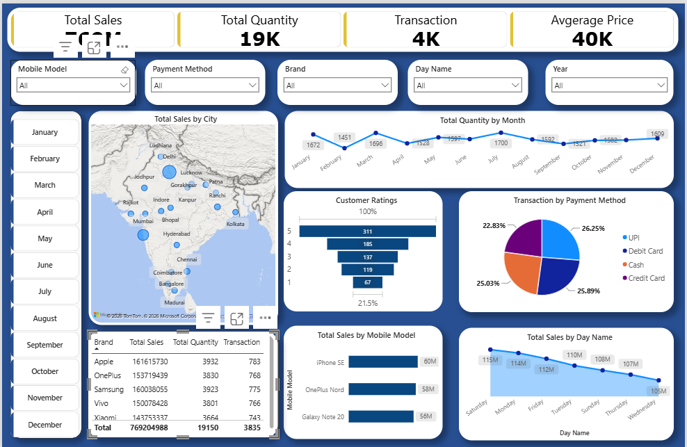

# 📱 Mobile Sales Analysis

**Interactive Sales Dashboard | Microsoft Excel • Power BI**

---

## 📌 Project Overview

I developed this project to analyze mobile sales data and identify sales trends, customer preferences, and regional performance using Microsoft Excel and Power BI. The dashboard provides interactive visualizations that help understand business performance and support data-driven decision-making.

---

## 🎯 Business Objectives

- Analyze overall mobile sales performance.
- Identify top and low-performing mobile brands and models.
- Evaluate city-wise sales performance.
- Understand customer rating trends.
- Analyze monthly and day-wise sales patterns.

---

## 🛠️ Tools Used

- Microsoft Excel
- Power BI

---

## 📂 Dataset Information

- Mobile Sales Dataset
- Cleaned and analyzed using Microsoft Excel
- Interactive dashboard created in Power BI

---

## 📊 Dashboard Preview

---

## 🔍 Key Business Insights

- Apple generated the highest sales and recorded the highest number of transactions.
- The iPhone SE was the highest-selling mobile model, while OnePlus 9, Vivo S1, and Redmi 9 recorded the lowest sales.
- Most customers gave 5-star ratings, indicating high overall customer satisfaction.
- Mumbai generated the highest sales, and Samsung was the top-selling brand within Mumbai.
- July recorded the highest quantity sold, while February recorded the lowest, indicating seasonal demand patterns.
- Saturday recorded the highest sales, whereas Wednesday recorded the lowest.

---

## 💡 Business Recommendations

- Maintain adequate stock of Apple products, especially the iPhone SE, to meet customer demand.
- Review the performance of low-selling models to identify opportunities for improving sales.
- Focus on high-performing markets like Mumbai while developing strategies to increase sales in other cities.
- Plan promotional campaigns during weekends and high-demand months such as July.

---

## 📁 Repository Contents

- Mobile Sales Dataset
- Power BI Dashboard
- Dashboard Screenshot
- Project Report

---

## 👩‍💻 About Me

**Nikita Sharma**

Aspiring Data Analyst with hands-on experience in Excel, SQL, Python, and Power BI. Passionate about transforming raw data into meaningful business insights through data analysis and interactive dashboards.
